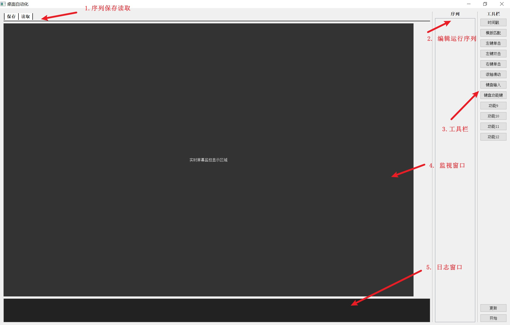
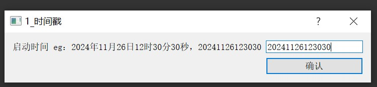
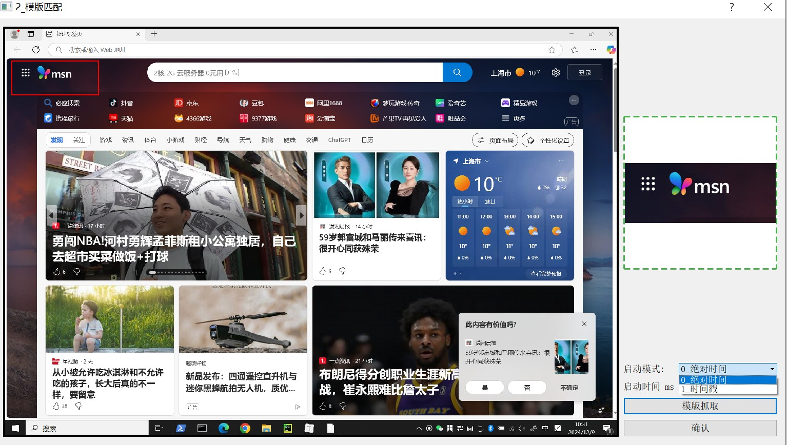
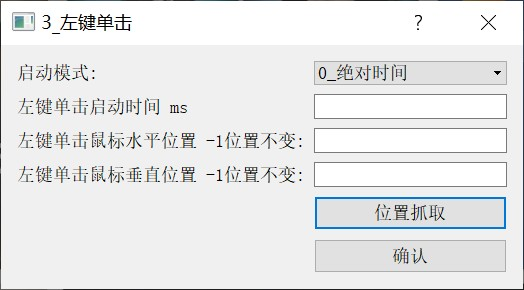
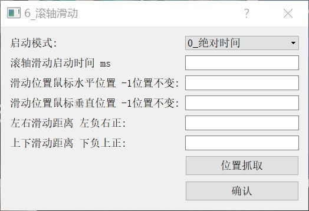
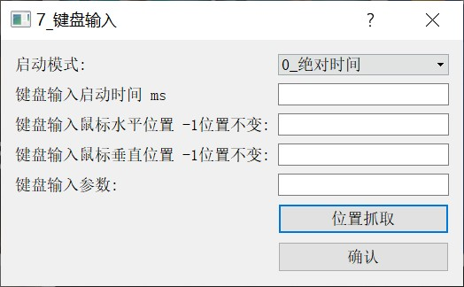
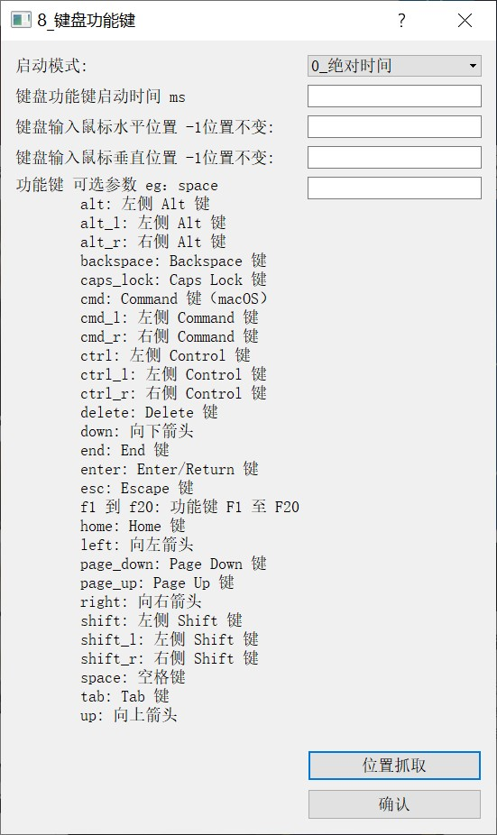

# 桌面自动化控制

### 1、软件下载：[地址](https://gitee.com/link?target=https%3A%2F%2Fgithub.com%2Fweishida01%2Fcomputer-control%2Freleases%2Fdownload%2Fv1.0.3%2Fcomputer_control.exe)

### 2、软件介绍

1. 一款电脑桌面自动化控制软件

2. 说明
   1. 个人持续开发
   2. 功能运行有不合理和和不健壮的地方，还请见谅
3. 软件优点
   1. 可以自己个性化的自己编辑电脑控制序列，软件按照自己编辑的序列按照顺序控制电脑运行
   2. 基础的鼠标，键盘功能
   3. 机器学习
      1. 模版匹配
      2. 直线检测（待扩展）
      3. 园检测（待扩展）
   4. 深度学习
      1. （待扩展）

### 3、软件使用教程

**主界面介绍**

1. 序列保存读取
2. 运行序列栏
3. 工具栏
4. 监视窗口
5. 日志窗口

### 4、软件工具介绍

1. #### 基础使用

   1. 鼠标双击 工具栏的工具 可以把工具添加到执行序列
   2. 鼠标点击 序列栏的序列 可以编辑工具的具体参数
   3. 鼠标右键 序列栏的序列 可以删除对应序列
   4. 鼠标点击监控画面栏的任意位置，可以在监控画面栏右下角，显示此时鼠标的位置，同时显示系统时间
   5. 点击右下角的更新按钮 在5s后会单次更新一下监控的画面（默认监控的是电脑的主界面）
   6. 点击右下角的开始 开始按照用户编辑的序列运行
   7. 左上角的保存读取，可以保存用户此时的序列，可以再下次用的时候直接读取调用

2. #### 工具介绍

   1. ##### 时间戳

      

      输入标准格式的时间，在输入标准格式的时间后，当到达此时间点，时间戳工具运行成功，可以配合其他工具使用

      eg：时间戳+左键单击，当时间到达时间戳自定义的时间后，开启鼠标单击功能

   2. ##### 模版匹配

      

      工具按照设定的 模版 在监控画面中持续检测，直到在监控画面中匹配到模版的画面，如上图，监控画面红中是否出现右边模版的标志，如出现，则匹配成功

      参数介绍：

       	1. 启动模式：此工具开始执行的时间
            	1. 默认 绝对时间（为程序启动的时间）
            	2. 也可以选择此工具之前已经启动的其他工具的执行结束标志时间，如时间戳，为在时间戳工具执行成功后，模版匹配工具开始执行
       	2. 启动时间：为模版匹配开始执行后，xxms后，开始执行模版匹配扫描程序
       	3. 模版抓取：点击此按钮，可以在窗口界面，鼠标左键画box的形式，选取要匹配的模版
       	4. 确认：此工具参数确认

   3. ##### 左键单击

      

      工具在，一定条件下，在指定位置，开启 鼠标单击功能

      参数介绍：

      1. 启动模式：如模版匹配
      2. 启动时间：如模版匹配
      3. 水平位置：可以手动输入 鼠标单击的屏幕的水平位置 也可以从屏幕抓取（-1表示，不该表鼠标位置）
      4. 垂直位置：可以手动输入 鼠标单击的屏幕的垂直位置 也可以从屏幕抓取（-1表示，不该表鼠标位置）
      5. 位置抓取：鼠标点击监控画面要点击的位置，再点击此按钮，可以自动把点击的位置，输入到3,4的位置

   4. ##### 左键双击

      同左键单击

   5. ##### 右键单击

      同左键单击

   6. ##### 滚轴滑动

      

      执行鼠标的上滑下滑功能

      参数介绍：

      1. 启动模式：同左键单击
      2. 启动时间：同左键单击
      3. 滑动位置鼠标水平位置：同左键单击
      4. 滑动位置鼠标垂直位置：同左键单击
      5. 左右滑动距离：滚轴左右滑动
      6. 上下滑动距离：滚轴上下滑动
      7. 位置抓取按钮：同左键单击

   7. ##### 键盘输入

      

      在指定位置输入参数，代替键盘打字功能

      参数介绍：

      1. 启动模式：同左键单击
      2. 启动时间：同左键单击
      3. 键盘输入鼠标水平位置：同左键单击
      4. 键盘输入鼠标垂直位置：同左键单击
      5. 键盘输入参数：要通过键盘输入的内容
      6. 位置抓取按钮：同左键单击

   8. ##### 键盘功能键

      

      代替键盘的指定的功能键

      参数介绍：

      1. 启动模式：同左键单击
      2. 启动时间：同左键单击
      3. 鼠标水平位置：同左键单击
      4. 鼠标垂直位置：同左键单击
      5. 功能键：只能输入可选参数的指定的内容，小写，如：enter
      6. 位置抓取按钮：同左键单击

   9. ##### 功能x

      待开发功能

   10. 

